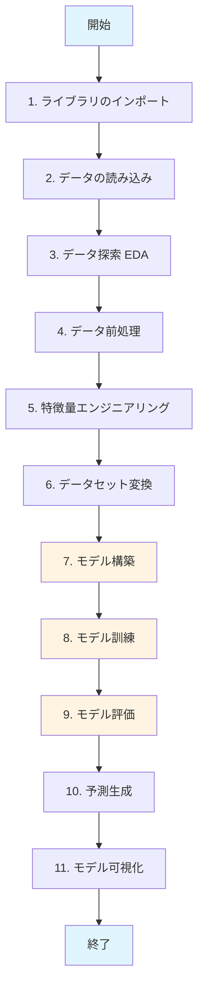
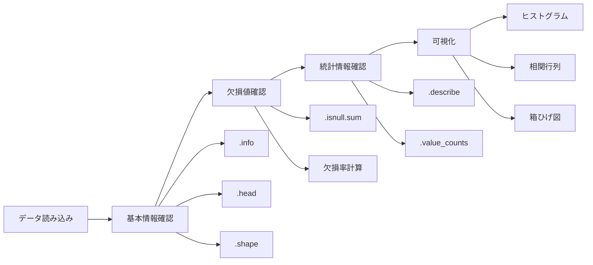
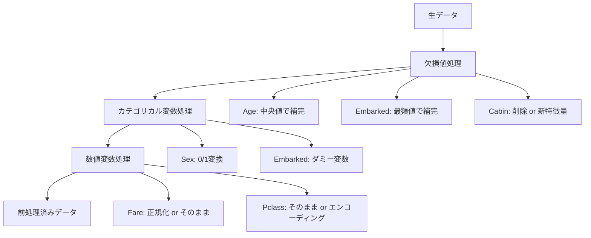
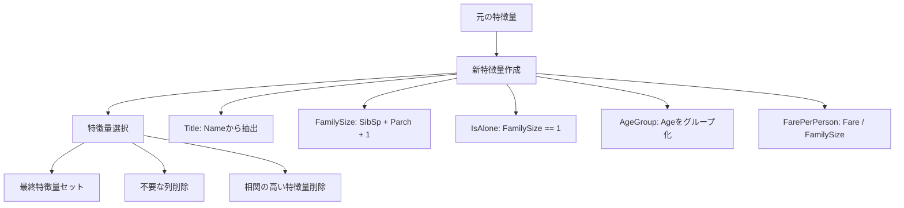
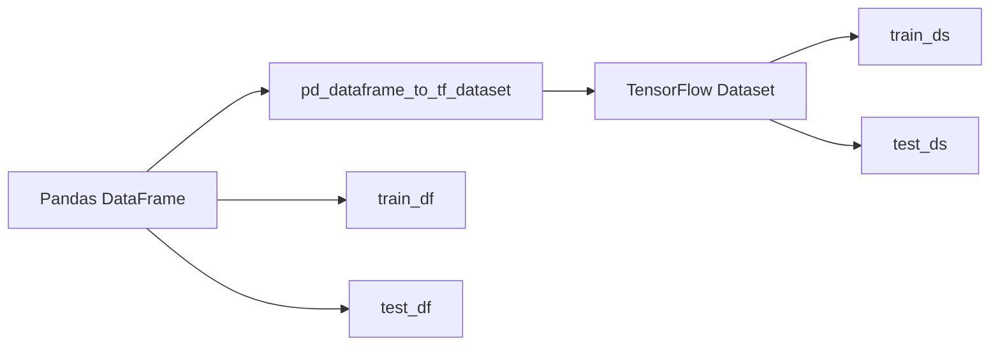
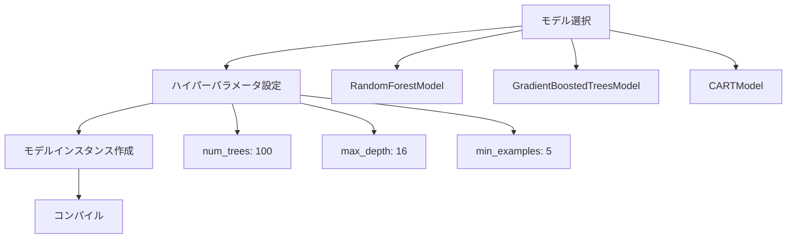
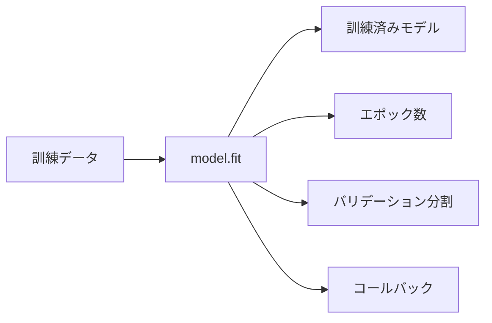
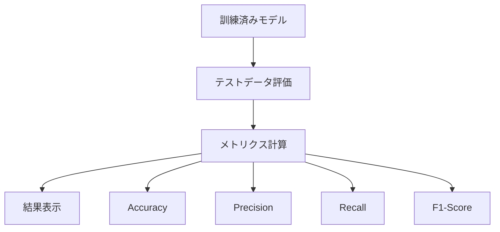
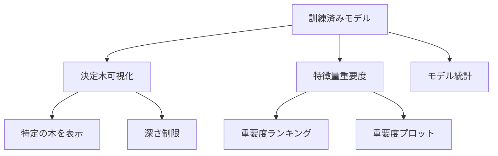
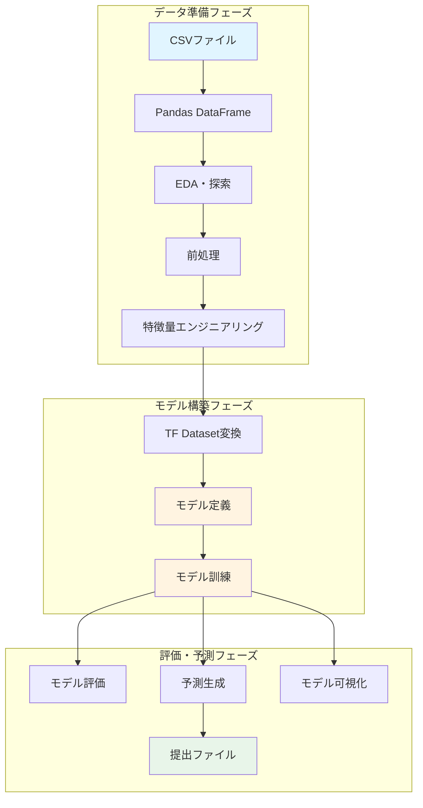

# Titanic TensorFlow Decision Forests ノートブック - 手順可視化

## 📊 全体フローチャート



## 🔍 詳細手順

### ステップ1: ライブラリのインポート

```python
import tensorflow as tf
import tensorflow_decision_forests as tfdf
import pandas as pd
import numpy as np
import matplotlib.pyplot as plt
import seaborn as sns
```

**目的**: 必要なライブラリを準備

---

### ステップ2: データの読み込み

```python
train_df = pd.read_csv('/kaggle/input/titanic/train.csv')
test_df = pd.read_csv('/kaggle/input/titanic/test.csv')
```

**データ構造**:
- `train.csv`: 891行 × 12列（Survived含む）
- `test.csv`: 418行 × 11列（Survivedなし）

---

### ステップ3: データ探索（EDA）



**実行コード例**:
```python
# 基本情報
train_df.info()
train_df.describe()

# 欠損値確認
train_df.isnull().sum()

# 可視化
sns.histplot(train_df['Age'].dropna(), bins=30)
plt.title('Age Distribution')
plt.show()
```

---

### ステップ4: データ前処理



**実行コード例**:
```python
# 欠損値補完
train_df['Age'].fillna(train_df['Age'].median(), inplace=True)
train_df['Embarked'].fillna(train_df['Embarked'].mode()[0], inplace=True)

# カテゴリカル変数エンコーディング
train_df['Sex'] = train_df['Sex'].map({'male': 0, 'female': 1})
train_df = pd.get_dummies(train_df, columns=['Embarked'], prefix='Emb')
```

---

### ステップ5: 特徴量エンジニアリング



**実行コード例**:
```python
# Title抽出
train_df['Title'] = train_df['Name'].str.extract(' ([A-Za-z]+)\.', expand=False)
title_mapping = {"Mr": 1, "Miss": 2, "Mrs": 3, "Master": 4, "Rare": 5}
train_df['Title'] = train_df['Title'].map(title_mapping)

# FamilySize
train_df['FamilySize'] = train_df['SibSp'] + train_df['Parch'] + 1
train_df['IsAlone'] = (train_df['FamilySize'] == 1).astype(int)
```

---

### ステップ6: データセット変換



**実行コード**:
```python
# ラベル列を指定して変換
train_ds = tfdf.keras.pd_dataframe_to_tf_dataset(
    train_df.drop('Survived', axis=1), 
    label='Survived'
)

# テストデータ（ラベルなし）
test_ds = tfdf.keras.pd_dataframe_to_tf_dataset(
    test_df
)
```

---

### ステップ7: モデル構築



**実行コード**:
```python
# ランダムフォレストモデル
model = tfdf.keras.RandomForestModel(
    num_trees=100,
    max_depth=16,
    min_examples=5,
    task=tfdf.keras.Task.CLASSIFICATION
)

# コンパイル（メトリクス指定）
model.compile(metrics=['accuracy'])
```

---

### ステップ8: モデル訓練



**実行コード**:
```python
# モデル訓練
model.fit(train_ds)

# または、バリデーション分割あり
model.fit(
    train_ds,
    validation_split=0.2,
    verbose=1
)
```

---

### ステップ9: モデル評価



**実行コード**:
```python
# 評価
evaluation = model.evaluate(test_ds, return_dict=True)
print(f"Test Accuracy: {evaluation['accuracy']:.4f}")

# 予測
predictions = model.predict(test_ds)
predictions_binary = (predictions > 0.5).astype(int)
```

---

### ステップ10: 予測生成と提出


**実行コード**:
```python
# 予測
predictions = model.predict(test_ds)
predictions_binary = (predictions > 0.5).astype(int).flatten()

# 提出ファイル作成
submission = pd.DataFrame({
    'PassengerId': test_df['PassengerId'],
    'Survived': predictions_binary
})

submission.to_csv('submission.csv', index=False)
```

---

### ステップ11: モデル可視化



**実行コード**:
```python
# 決定木の可視化
tfdf.model_plotter.plot_model_in_colab(model, tree_idx=0, max_depth=3)

# 特徴量重要度
importances = model.make_inspector().variable_importances()
print(importances)

# 統計情報
inspector = model.make_inspector()
print(inspector.num_trees())
print(inspector.evaluation())
```

---

## 📈 データフロー全体図



## 🎯 重要なポイント

1. **TF-DFの利点**: カテゴリカル変数を自動処理、前処理が簡単
2. **特徴量エンジニアリング**: Title、FamilySizeなどが重要
3. **モデル選択**: RandomForestModelが一般的に良い性能
4. **可視化**: 決定木の構造を確認して解釈性を確保

## 📝 典型的なコード構造

```python
# ============================================
# 1. インポート
# ============================================
import tensorflow as tf
import tensorflow_decision_forests as tfdf
import pandas as pd

# ============================================
# 2. データ読み込み
# ============================================
train_df = pd.read_csv('/kaggle/input/titanic/train.csv')
test_df = pd.read_csv('/kaggle/input/titanic/test.csv')

# ============================================
# 3. 前処理
# ============================================
# 欠損値処理、特徴量エンジニアリングなど

# ============================================
# 4. データセット変換
# ============================================
train_ds = tfdf.keras.pd_dataframe_to_tf_dataset(
    train_df.drop('Survived', axis=1), 
    label='Survived'
)

# ============================================
# 5. モデル構築・訓練
# ============================================
model = tfdf.keras.RandomForestModel()
model.compile(metrics=['accuracy'])
model.fit(train_ds)

# ============================================
# 6. 予測・提出
# ============================================
test_ds = tfdf.keras.pd_dataframe_to_tf_dataset(test_df)
predictions = model.predict(test_ds)
# 提出ファイル作成...
```

